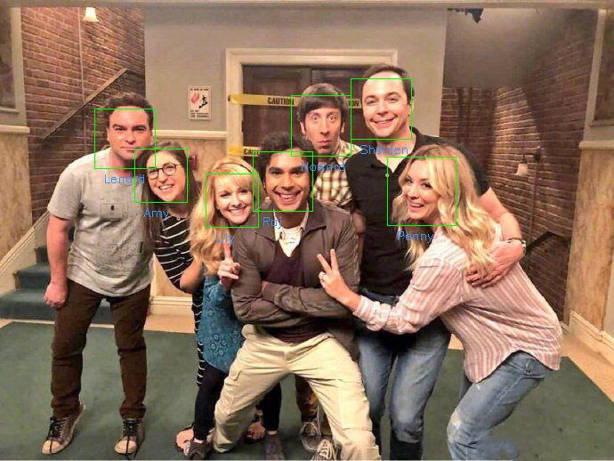

# Face Recognition



```sh
python3 face_recognizer.py -h
usage: face_recognizer.py [-h] [-d DATASET] [-i IMAGE] [-v VIDEO]
                          [-r RECOGNIZER]

optional arguments:
  -h, --help            show this help message and exit
  -d DATASET, --dataset DATASET
                        directory of image dataset with human faces
  -i IMAGE, --image IMAGE
                        input image for face recognization
  -v VIDEO, --video VIDEO
                        input video file, or camera interface (default: 0) for
                        recognization
  -r RECOGNIZER, --recognizer RECOGNIZER
                        model to recognize face

```

Face recognition with a pretrained model
```sh
python3 train_face_recognizer.py -d ./bigbang/ --recognizer recognizer_svc.pickle -m svc

python3 face_recognizer.py -r recognizer_svc.pickle -v ./bigbang/bigbangtheory.mp4
```

Face recognition with image dataset (comparing with evey image faces)
```sh
python3 face_recognizer.py -d ./bigbang/ -v ./bigbang/bigbangtheory.mp4
```
